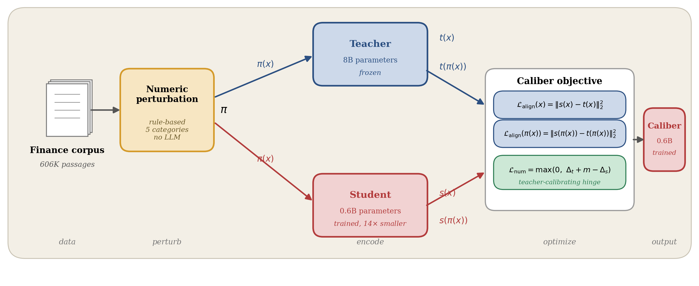

# Caliber

**Beyond Imitation: A Resource-Adaptive Embedder that Outperforms Its 14× Larger Teacher on Financial Retrieval**

Caliber is a knowledge-distillation recipe for financial text embedders. It keeps the
alignment-only training of [LEAF](https://arxiv.org/abs/2509.12539) but adds a
*teacher-calibrating* numeric-faithfulness hinge: instead of imitating the teacher
everywhere, the student is asked to discriminate numeric perturbations (e.g.
*"revenue grew 12.4%"* vs. *"1.24%"*) **more strongly than the teacher does**.

After one training epoch on 606K passages, the 0.6B Caliber student exceeds its zero-shot
8B teacher on FinanceBenchRetrieval by **14.3% relative nDCG@10** while using **14× fewer
parameters**, and improves numeric discrimination (NumGap-D) over the alignment-only
baseline by **20.6% relative**. The recipe needs no relevance judgments and no hard negatives.

<p align="center">
  
</p>

## Method

Teacher embeddings are precomputed once and cached; only the 0.6B student is trained.
For each passage `x` with an optional numeric perturbation `π(x)`, the objective is

$$\mathcal{L}_{\text{align}}(x) = \lVert s(x) - t(x) \rVert_2, \qquad \mathcal{L}_{\text{align}}(\pi(x)) = \lVert s(\pi(x)) - t(\pi(x)) \rVert_2$$

$$\mathcal{L}_{\text{num}} = \max\!\big(0,\; \Delta_t + m - \Delta_s\big), \qquad \Delta_f = 1 - \cos\!\big(f(x), f(\pi(x))\big)$$

$$\mathcal{L} = \mathcal{L}_{\text{align}}(x) + \mathbb{1}[\exists\,\pi]\,\big(\mathcal{L}_{\text{align}}(\pi(x)) + \lambda_{\text{num}}\,\mathcal{L}_{\text{num}}\big)$$

where `Δ_t` is the teacher's discrimination on the pair `(x, π(x))` — precomputed and cached —
and `Δ_s` is the student's. The hinge `L_num` is zero whenever the student already separates
`x` from `π(x)` more strongly than the teacher plus a margin `m`; setting `λ_num = 0` recovers
the LEAF alignment-only baseline.

## Results

FinanceBenchRetrieval (n=150) and NumGap, all 1-epoch on 606K passages:

| Method            | Params | nDCG@10 | Recall@10 | MRR@10 | NumGap-D |
|-------------------|:------:|:-------:|:---------:|:------:|:--------:|
| Initial (student) | 0.6B   | 0.365   | 0.533     | 0.314  | 0.032    |
| Teacher (zero-shot)| 8.0B  | 0.406   | 0.593     | 0.346  | 0.048    |
| LEAF (λ=0)        | 0.6B   | 0.440   | 0.687     | 0.363  | 0.038    |
| **Caliber (λ=0.5)** | **0.6B** | **0.464** | **0.700** | **0.392** | **0.045** |

Caliber improves on every retrieval metric over both the teacher and LEAF, and is the
best small model on NumGap-D (magnitude, polarity, and overall). Full per-category and
loss-decomposition numbers are in [`results.json`](results.json).

## Repository layout

```
.
├── caliber/
│   ├── perturb.py              # Numeric perturbation operator π (5 rule categories)
│   └── train.py                # Training loop: L2 alignment + numeric hinge
├── scripts/
│   ├── extract_teacher_perturb.py   # Cache teacher embeddings for corpus + perturbations
│   ├── build_numgap.py              # Build the NumGap evaluation triples
│   ├── eval_numgap.py               # NumGap-D / NumGap-M evaluator
│   ├── eval_mteb.py                 # MTEB FinanceBenchRetrieval wrapper
│   ├── eval_asym.py                 # Asymmetric retrieval evaluator
│   └── collect_results.py           # Aggregate per-evaluator CSVs into a table
├── configs/                    # λ sweep configs (λ ∈ {0.0, 0.1, 0.5, 1.0})
├── distill_caliber.py          # Training entry point
├── results.json                # Reported metrics and loss decomposition
└── assets/                     # Framework figure
```

## Installation

```bash
pip install -r requirements.txt
```

The teacher is [Qwen3-Embedding-8B](https://huggingface.co/Qwen/Qwen3-Embedding-8B) and
the student is initialized from
[Qwen3-Embedding-0.6B](https://huggingface.co/Qwen/Qwen3-Embedding-0.6B). The teacher's
4096-d output is Matryoshka-truncated to 1024 to match the student. Mean pooling of the
last hidden state is used for extraction, training, and evaluation.

## Pipeline

Set the model/data paths in `configs/caliber_lambda*.yaml`, then:

**1. Precompute teacher embeddings (with perturbations).** Input is a corpus parquet with
`text_id, text, source` columns.

```bash
python scripts/extract_teacher_perturb.py \
    --corpus        /data/caliber/corpus.parquet \
    --teacher_model /models/Qwen3-Embedding-8B \
    --out           /data/caliber/teacher_emb_with_perturb.parquet \
    --batch_size 32 --max_length 512 --dtype bfloat16 --seed 42
```

**2. Train.** `λ_num = 0` is the LEAF baseline; `λ_num = 0.5` is Caliber.

```bash
python distill_caliber.py --config configs/caliber_lambda05.yaml   # Caliber
python distill_caliber.py --config configs/caliber_lambda00.yaml   # LEAF baseline
```

Any field can be overridden from the command line, e.g. a single-epoch run:

```bash
python distill_caliber.py --config configs/caliber_lambda05.yaml \
    --override num_epochs=1 output_dir=/data/caliber/runs/caliber_lambda05
```

**3. Build the NumGap test set and evaluate.**

```bash
python scripts/build_numgap.py \
    --corpus /data/caliber/corpus.parquet \
    --out    /data/caliber/numgap_v1.jsonl \
    --n_test 2000 --n_dev 500 --seed 13

python scripts/eval_numgap.py --numgap /data/caliber/numgap_v1.jsonl \
    --model /data/caliber/runs/caliber_lambda05/final --split test \
    --out   /data/caliber/runs/caliber_lambda05/numgap_metrics.csv

python scripts/eval_mteb.py --model /data/caliber/runs/caliber_lambda05/final \
    --tasks FinanceBenchRetrieval \
    --out_dir /data/caliber/runs/caliber_lambda05/mteb
```

**4. Aggregate.**

```bash
python scripts/collect_results.py --runs_dir /data/caliber/runs --out results_table.csv
```

## NumGap

NumGap tests whether an embedder treats a numerically altered passage as a different fact.
Each record is a triple `(x, π(x), x_dist)`, where `π(x)` changes only numeric content and
`x_dist` is a topical but numerically unrelated distractor sampled by BM25. A record is
correct when `cos(x, π(x)) < cos(x, x_dist)` — the numeric edit is a larger semantic break
than topical drift. The primary metric **NumGap-D** is the fraction of correct records
(random baseline 0.5); **NumGap-M** is the mean margin. The released v1 split has 1,300 test
records across magnitude, polarity, and unit categories.

## Reproducing the paper

The reported numbers are one-epoch lower bounds: `λ=0` (LEAF) and `λ=0.5` (Caliber), both
trained for one epoch on the 606K-passage corpus (≈1.95 h on a single GPU each), with
AdamW, lr 1e-4, batch 32, max length 512, bfloat16, and margin `m=0.05`. Run steps 1–4
above with `--override num_epochs=1`.

## Citation

```bibtex
@inproceedings{mahdizadeh2026caliber,
  title     = {Beyond Imitation: A Resource-Adaptive Embedder that Outperforms
               Its 14$\times$ Larger Teacher on Financial Retrieval},
  author    = {Mahdizadeh, Ailar and Salari, Aria and Rajabi, Sohail and
               Mirabbasi, Shahriar and Nasiopoulos, Panos and Morsali, Alireza},
  booktitle = {ICML 2026 Workshop on Adaptive Foundation Models (AdaptFM)},
  year      = {2026}
}
```
